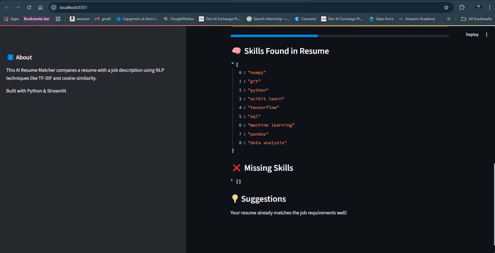

# AI Resume Matcher

An AI-powered web application that compares a candidate’s resume with a job description
and provides a match score, missing skills, and improvement suggestions.

## 🚀 Features
- Upload resume in PDF format
- Paste job description
- Resume–JD match score using NLP
- Skill gap analysis
- Actionable improvement suggestions
- Interactive web UI

## 🛠 Tech Stack
- Python
- Streamlit
- Scikit-learn
- NLTK
- PyPDF2

## 🧠 How It Works
1. Resume PDF text is extracted and cleaned
2. Job description text is preprocessed
3. TF-IDF vectorization converts text into numerical vectors
4. Cosine similarity calculates the match percentage
5. Skills are extracted and compared to find gaps

## ▶ Run Locally
```bash
pip install -r requirements.txt
streamlit run app.py

## 📸 Application Screenshots

### Resume Upload Page


### Resume Match Score


### Skills & Missing Skills


